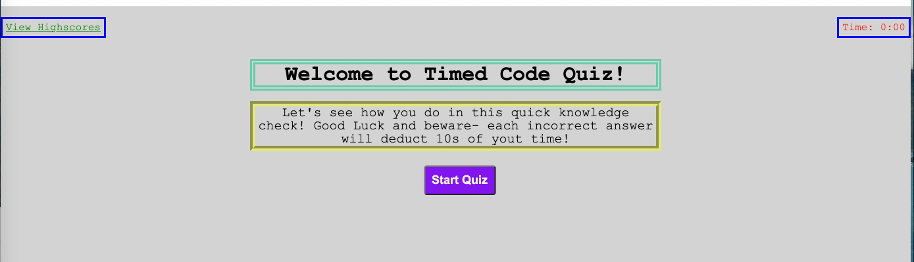
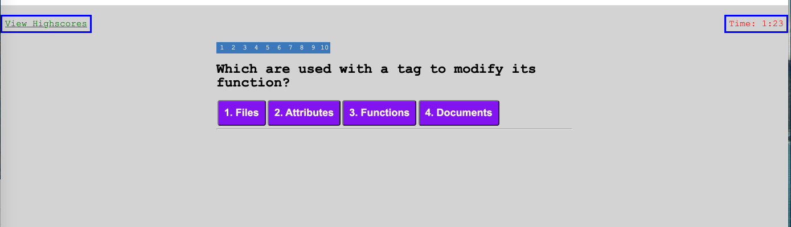
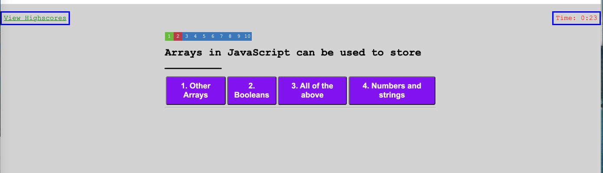
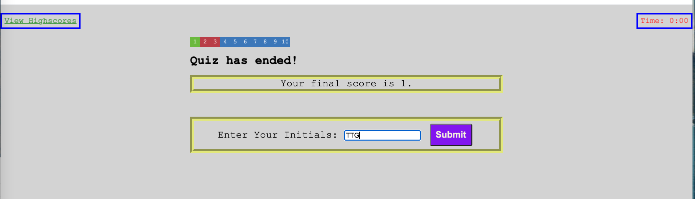
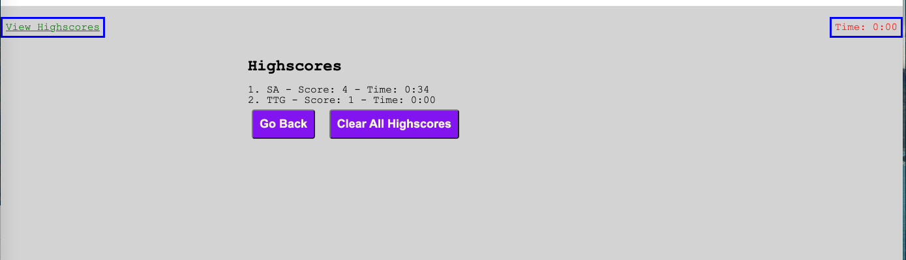

<h1 align='center'>Timed Code Quiz</h1>
  
  ### By likica * [Email me](mailto:codefin9@hotmail.com)) * 
  * [Deployed Appplication](https://likica.github.io/timed-code-quiz/)
 
  ## Table of contents
  * [Description](#Description)
  * [Installation Instructions](#installation-Instructions)
  * [Usage Instructions](#Usage-Instructions)
  * [Questions](#Questions)
  * [Contributing](#Contributing)
  * [Tests](#Tests)
 
  # Description
  ##### [Back to Table of Contents](#Table-of-Contents)
  This was a challenging project for new coders but rewarding at the end. It is a fun quiz that will alow you refresh or memorize certain information about coding, ad well as see your highscore and try to beat it to get all questions right in least time possible!

  ## User Story
  ##### [Back to Table of Contents](#Table-of-Contents)
  * AS A coding boot camp student * I WANT to take a timed quiz on JavaScript fundamentals that stores high scores * SO THAT I can gauge my progress compared to my peers

  ## Installation Instructions
  ##### [Back to Table of Contents](#Table-of-Contents)
  Click the deployed application link and have fun answering questions!

  ## Usage Instructions
  ##### [Back to Table of Contents](#Table-of-Contents)
  1. Open the Link in your Web Browser and Landing Page of the quiz will appear
  

    

  2. Start the quiz clicking "start" button. Pay attention to timeclock ticking away and try to answer questions correctly, otherwise each incorrect answer will deduct 10 sec from your time 
  

    

    

  3. Once finished answering questions, you will get your score and chance to enter your initials 
  

    

  4. Once you enter your initials, you can save your score with time lapsed and correct/incorrect questions amount. You can either View or Clear your Highscores by clicking on the "Clear/View Highscores" buttons and/or return to try again by clicking "Go Back" button
  

    

  ## Contributing
  ##### [Back to Table of Contents](#Table-of-Contents)
  Other can contribute within limits of MIT locense

  ## Tests
  #### [Back to Table of Contents](#Table-of-Contents)
  1. none
  2. none 

  ## Questions
  ##### [Back to Table of Contents](#Table-of-Contents)
  * If you have any questions, please contact me at codefin9@hotmail.com)

  ## License 
  * License Type: MIT
    
    [License: MIT](https://opensource.org/licenses/MIT)
    Permission is hereby granted, free of charge, to any person obtaining a copy of this software and associated documentation files (the "Software"), to deal in the Software without restriction, including without limitation the rights to use, copy, modify, merge, publish, distribute, sublicense, and/or sell copies of the Software, and to permit persons to whom the Software is furnished to do so, subject to the following conditions:The above copyright notice and this permission notice shall be included in all copies or substantial portions of the Software.THE SOFTWARE IS PROVIDED "AS IS", WITHOUT WARRANTY OF ANY KIND, EXPRESS OR IMPLIED, INCLUDING BUT NOT LIMITED TO THE WARRANTIES OF MERCHANTABILITY, FITNESS FOR A PARTICULAR PURPOSE AND NONINFRINGEMENT. IN NO EVENT SHALL THE AUTHORS OR COPYRIGHT HOLDERS BE LIABLE FOR ANY CLAIM, DAMAGES OR OTHER LIABILITY, WHETHER IN AN ACTION OF CONTRACT, TORT OR OTHERWISE, ARISING FROM, OUT OF OR IN CONNECTION WITH THE SOFTWARE OR THE USE OR OTHER DEALINGS IN THE SOFTWARE.

  _This README was generated by Likica with_ ❤️ [GitHub Profile](https://github.com/likica)
 
  
